**SELKS Nedir?**

SELKS kısaca Stamus Networks tarafından geliştirilen debian tabanlı,
kullanıma hazır suricata Saldırı tespit/engelleme sistemi ve Suricata
kural seti yönetimi web arayüzü Scirius’tan oluşan açık kaynaklı bir
projedir.

SELKS ismini baş harflerinden oluşturan temel bileşenler şunlardır:

-   S - Suricata IDPS
    - [*http://suricata-ids.org/*](http://suricata-ids.org/)

-   E - Elasticsearch
    - [*http://www.elasticsearch.org/overview/*](http://www.elasticsearch.org/overview/)

-   L - Logstash
    - [*http://www.elasticsearch.org/overview/*](http://www.elasticsearch.org/overview/)

-   K - Kibana
    - [*http://www.elasticsearch.org/overview/*](http://www.elasticsearch.org/overview/)

-   S - Scirius
    - [*https://github.com/StamusNetworks/scirius*](https://github.com/StamusNetworks/scirius)

**Suricata**

Suricata Open Information Security Foundation (OISF) tarafından
geliştirilen açık kaynaklı bir Saltırı tespit/engelleme sistemidir.
Başka bir saldırı tespit/engelleme sistemi olan Snort’un kural seti ile
çalışabilmektedir ve Snort gibi imza/kural tabanlı çalışmaktadır. Ayrıca
suricata multi-threaded çalışabildiği için yüksek derecede
ölçeklenebilir bir sistemdir.

**ElasticSearch**

ElasticSearch yatay ölçeklenebilirlik, güvenilirlik ve kolay
yönetilebilirlik ilkeleri temel alınarak tasarlanmış açık tabanlı bir
arama motoru ve analitik motordur. Gerçek zamanlı indeksleme yapar ve
SELKS’in bir parçası olarak suricata tarafından üretilen alarmları daha
sonra analiz edilmek üzere kaydeder.

**Logstash**

StamusNetworks tarafından geliştirilen Logstash özet olarak log
kayıtlarını ve olayları işleyerek belirli bir formatta kaydeder.
SELKS’in bir parçası olarak ise Suricata tarafından üretilen JSON
tipindeki verileri analiz edebilmeye daha uygun bir formata getirmek
için işler ve ElasticSearch’e daha sonra analiz edilmek üzere kaydeder.

**Kibana**

Kibana, StamusNetworks tarafından geliştirilen açık kaynaklı bir
görselleştirme platformudur. Verilerinizin güçlü bir şekilde grafiksel
olarak gösterimini sağlar. SELKS’in bir parçası olarak Kibana,
ElasticSearch’e kaydedilen verilerin bir web arayüzü kullanılarak
sorgulamamıza ve grafiksel olarak görüntülememize imkan verir. Önceden
oluşturulmuş panolar sayesinde, ekstradan pano oluşturmadan bu panoları
kullanarak Suricata trafiğini analiz etmiş oluyoruz.

**Scirius**

Scirius Suricata kural seti yönetimini gerçekleştirmek için
geliştirililen bir web arayüzüdür. StamusNetworks tarafından
geliştirilmiştir.

**Nasıl İndirilir?**

SELKS bedava olup yüklenebilir versiyonu LXDE X- masaüstü yöneticisini
kullanmaktadır. Aşağıda indirme linki verilen Stamus Networks’un
sitesinde SELKS’in yükleme gerektirmeyen(Live) ve Masaüstü(yüklenebilir)
olmak üzere iki çeşit ISO dosyası bulunmaktadır.

<https://www.stamus-networks.com/open-source/#selks>

Live modu ile uzun bir kuruluma ihtiyaç duymadan kullanıma hazır bir
şekilde geliyor. Live modunda tüm işlemler herhangi bir grafik arayüzü
kullanmadan, komut satırı ve web arayüzlerinden gerçelşeltiriliyor. Live
modu kullanmak için indirilen ISO’you boot etmek yeterli olacaktır. Bu
kılavuzda SELKS’in LXDE x- masaüstü yöneticisini kullandığı yüklenebilir
versiyonunun(SELKS-2.1-desktop.ISO) Sanal makine kurulumu ve kullanımı
üzerinde durulacaktır.

**Kurulum**

SELKS’in Masaüstü versiyonunun performanslı çalışabilmesi için en az iki
çekirdek kullanılması ve minimum olarak 4GB bellek kullanılması tavsiye
edilmektedir. Suricata ve ElasticSearch multithreaded olarak çalıştığı
için ne kadar çok çekirdek kullanılırsa o kadar fazla performans elde
edilecektir.

Vmware’de Sanal makine ayarlarındaki CD/DVD(IDE) kısmındaki bağlantıyı
“Use ISO image file” ı işaretleyerek ve SELKS’in kurulum ISO’sunu
göstererek yapın. Vmware için tavsiye edilen ağ ayarları için aşağıdaki
şekilde gösterildiği gibi Sanal Makine ayarlarına girilerek “Network
Adapter” ayarlarındaki bağlantı şeklini “Bridged: Connected directly to
physical network” işaretleyip “Replicate physical network connection
state” kutucuğunu işaretlememiz gerekmekte. Böylelikle SELKS fiziksel
host un üzerinden geçen tüm trafiği analiz edebilecek.

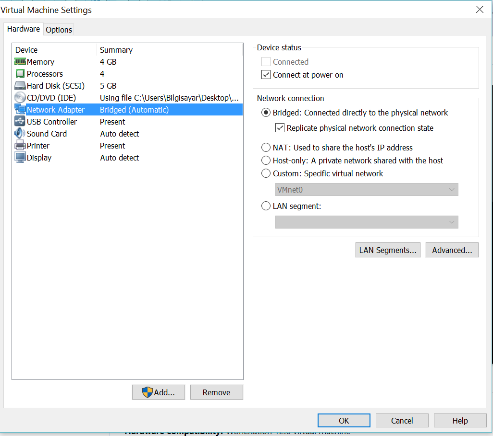{width="4.752474846894138in"
height="3.704937664041995in"}

Kurulumu en kolay şekilde yapmak için Sanal Makineyi SELKS Desktop ISO
dosyası ile boot ettikten sonra karşımıza çıkan Boot menu ekranından
Stamus SELKS Live (amd64)i seçin.

{width="4.712871828521434in"
height="3.534654418197725in"}.

Karşınıza gelen masaüstü yöneticisinden “Install Selks” i çalıştırın.

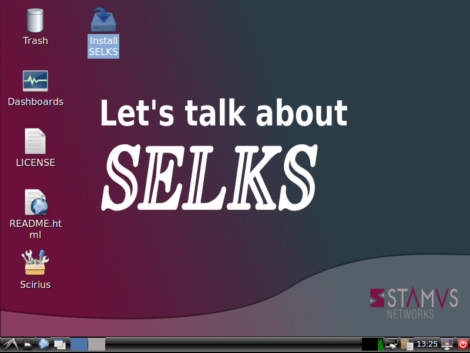{width="4.752474846894138in"
height="3.576405293088364in"}

Bu esnada karşınıza debian kurulum arayüzü gelecek ve sırasıyla
aşağıdaki şekilde verilen adıımları tamamlamanız istenecek.

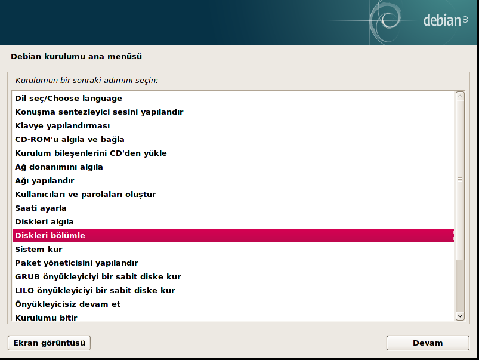{width="4.752474846894138in"
height="3.5685465879265093in"}

Dil ve konum seçimi yaptıntan sonra klavye yapılandırmanızı yapın.
Sonraki adımda ise Ağ yapılandırmak için bir makine adı ve ağ adı
girmenizi isteyecektir. Bu kısımdan sonra aşağıdaki gibi Sisttem
yöneticisi “root” için bir parola girmenizi bekleyecektir.

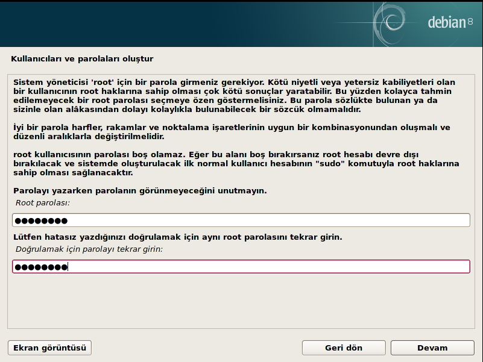{width="4.881925853018373in"
height="3.6630588363954506in"}

Sistem yöneticisi için bir parola girdikten sonra ise oluşturacağınız
kullanıcı için kullanıcı adı ve kullanıcı parolası girmeniz istenecek.
Bu bilgileride girdikten sonra saati ayarlama ve diskleri algılama işini
otomatik olarak yapılmakta. Disk bölümleme kısmında ise Bölümleme
yardımcısını kullanarak devam edebilirsiniz. Bölümleme yöntemi olarak
aşağıdaki şekildeki gibi diskin tamamını kılavuzlayın ve işleme devam
edin. Bölümlenecek alanı seçtikten sonra ise “Tüm dosyaları tek bölümde
bölümle”’yi seçerek devam edin.

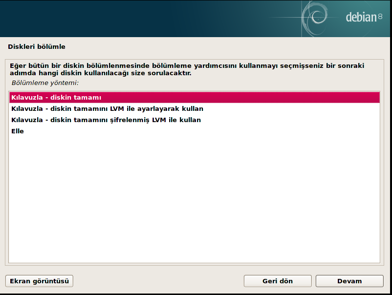{width="4.811881014873141in"
height="3.6237620297462816in"}

Sonraki disk bölümleme adımında ise bölümlendirmeyi bitiriğ
değişiklikleri diske kaydedin. Bu adımdan sonra sistem kurulma aşamasına
gelmiş olacaksınız. Kurulum bittikten sonra paket yöneticisini
yapılandırma kısmında “bir ağ yansısı kullanılsınmı” sorusuna evet
diyerek devam edin. Kendinize en yakın Debian arşiv yansısının bulunduğu
ülkeyi seçin ve sonraki adımda aşağıdaki resimdeki gibi karşınıza gelen
seçenekler arasından bir Debian arşiv yansısı seçin.

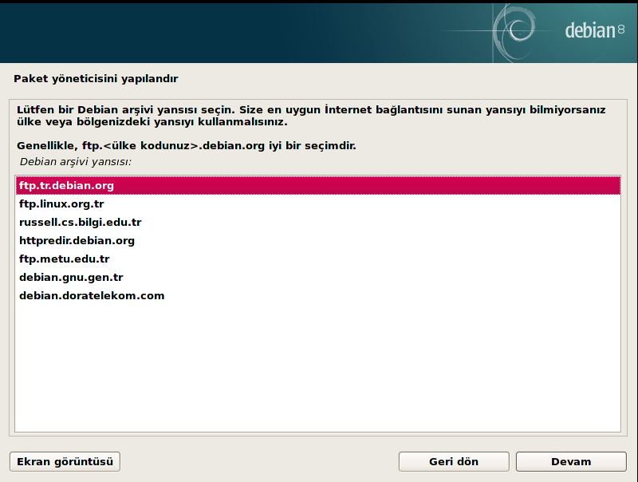{width="4.673267716535433in"
height="3.528132108486439in"}

Sonraki adımda dışa erişim için bir HTTP vekil sunucu kullanıyorsanız
sunucu bilgilerini girin, aksi taktirde boş bırakarak devam edin. Paket
yöneticisi yapılandırma işlemi bittikten sonra sistemi açabilmek için
GRUB önyükleyiciyi kurma adımına geliyoruz. GRUB önyükleyiciyi ana
önyükleme kaydına (MBR) ye kurmak için Sanal Makine ayarlarından
ayırdığımız Disk’i seçip oraya kuruyoruz. Aşağıdaki şekilde işlemin
nasıl ilerlediğini görebilirsiniz.

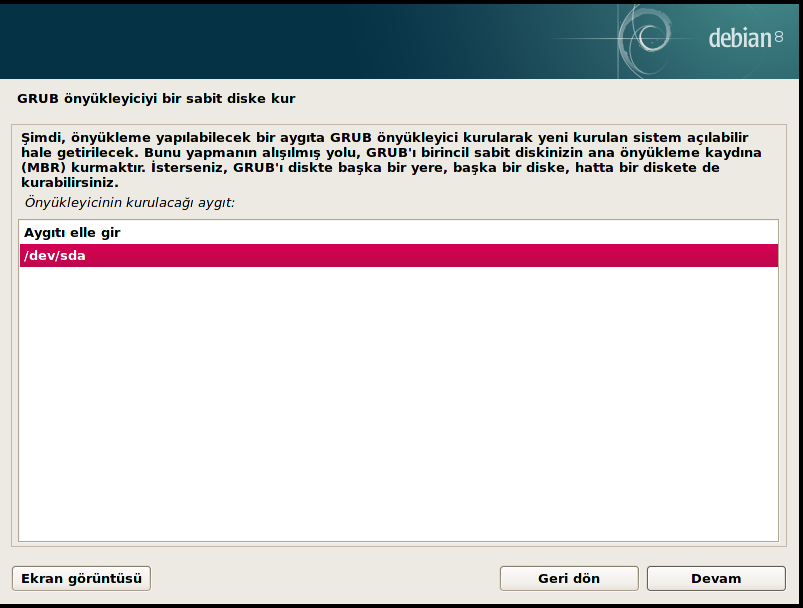{width="4.550586176727909in"
height="3.4455446194225723in"}

Bu adımdan sonra sistem kurulumunu tamamlamış oluyoruz. Artık Sanal
Makina üzerinden kurulum adımında vermiş olduğumuz kullanıcı adı ve
şifresini kullanarak sisteme giriş yapabiliriz.

**Kullanım**

Sisteme giriş yaptıktan sonra Scirius ve Kibana Dashboards’ı
kullanabilmek için web arayüzünden kimlik doğrulama yapmak için gereken
kullanıcı için default kullanıcı adı ve şifresi aşağıdaki gibidir:

-   Kullanıcı adı: selks-user

-   şifre: selks-user (live mod şifresi: live)

Default root şifresi: StamusNetworks

Bu şifreler daha sonra sciriusun sol yukarıdaki menüsündeki account
settings kısmından değiştirilebilir.

Elasticsearch, Logstash ve Suricata gömülü olarak geldiği için standart
servis olarakta kullanılabilir.

service suricata restart

service logstash stop

Komutları root terminal aracılığı ile kullanılarak kullanılabilir.
Suricata kural seti her gün 15:30 da update edilir ve suricata yeniden
başlatılır.

Scirius ve Kibanaya uzaktan HTTP erişim yapmak istenilirse browserinize

-   Scirius için <https://ip_adresiniz/rules/> - Scirius kural seti
    yönetimi

-   Kibana için <https://ip_adresiniz/log/> - Kibana Dashboard(pano)
    listesi

Yazmanız gerekmektedir. Kimlik doğrulama için gereken kullanıcı adı ve
şifre lokal erişim için istenen kullanıcı adı ve şifreyle aynıdır.

**Scirius Kullanım**

Scirius, Suricatanın kural seti yönetimi için geliştirilmiş bir web
arayüzüdür. Kurallar dosyası ile ilgili işlemleri yapmaya ve gerekli
dosyaları güncellemeye yarar. Scirius u kullanmak için LXDE masaüstü
yöneticisindeki Scrius iconuna tıklayıp kimlik doğrulama yapmak için
gereken kullanıcı için default kullanıcı adı ve şifresini girmek
yeterli. Kibana Dashboardlarına(Panolarına) Scirius web arayüzünde sol
üst tarafta bulunan Stamus iconuna tıklayarak ulaşabiliriz.

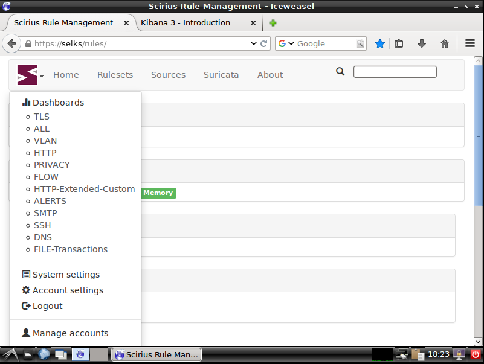{width="4.702970253718285in"
height="3.5401891951006124in"}

**Kural Seti Yönetimi**

Kural seti farklı kaynaklardaki bileşenlerden oluşturulur ve bu
kaynaklar Suricata’ya bilgi sağlayan dosyalar bütünüdür.

Kural seti oluşturmak için bir kaynaklar seti oluşturmak ve Kural seti
ile ilişkilendirmek gerekir. İlişkilendirme yapıldıktan sonra
kaynakların hangi elemanlarının kullanılacağı belirlenebilir. Örneğin,
imza kural seti oluşturduysak istediğimiz kategorilerdeki imzaları
seçerek istemediğimiz bir imzayı geçersiz kılabiliriz. Kural seti
tanımladıktan sonra Suricata’ya eklemek için web arayüzündeki
**Suricata**’ya kısma tıkladıktan sonra **Edit** kısmına tıklıyoruz ve
tanımladığımız kural setini seçip çıktı dizinini, isim ve tanım
alanlarını doldurduktan sonra (otomatik olarak doldurulmuş halde
karşımıza çıkıyor, değiştirilebilir) **Submit**’e basıyoruz.

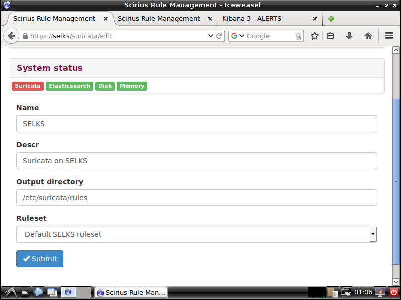{width="4.4077066929133855in"
height="3.2975207786526686in"}

Sonra tekrar **Suricata** kısmındaki **Actions** bölümüne gelerek
**Update** ye tıkladıktan sonra Update, Build ve Push seçeneklerini
seçtikten sonra **Apply** diyerek oluşturma ve ilişkilendirme işlemini
tamalamış oluyoruz. Update’i seçerek kural seti tarafından kullanılan
kaynakları güncellemiş oluyoruz. Build diyerek eklediğimiz kaynakların
şuanki halini kullanarak kaynak setini yapılandırmış oluyoruz. Ve Push
diyerek Suricatayı yapılandırıp Suricata ile ilişkilendirdiğimiz bu yeni
kural seti ile çalışması için yeniden çalıştırmış oluyoruz. Build ve
Push işlemini kural setinde herhangi bir değişiklik yaptıktan sonra
tekrar edip Suricatanın güncel kural seti ile tekrar çalıştırılmasını
sağlamamız gerekiyor.

**Suricata Bilgileri Menüsü**

Web arayüzündeki Suricata başlığına tıkladıktan sonra karşımıza
Suricata’nın çalışma esnasında elde edilmiş bilgileri
inceleyebileceğimiz 4 başlık çıkıyor bu başlıklar şöyle:

-   **Rules Activity (Kural Aktiviteleri):** Bu bölüm en düşük son 1
    saat en fazla son 1 hafta içerisinde Suricata’nın verdiği alarmlara
    hangi imzaların yol açtığı bilgilerini ve hangi imza yüzünden kaç
    kere alarm verildiği bilgisini taşır.

    İmza bilgisi için Rules Activity listesindeki imzanın üzerine
    tıklamak ve daha detaylı imza bilgisi için SID(imza numarasının)
    üzerine tıklamak yeterli olacaktır.

    Alerts Activity grafiğinde ise alarmların zaman ve yoğunluk
    dağılımını görebiliriz.

    En aşağıda görülebilecek Sunburst grafiği ise uyarıları tetikleyen
    imzalar hakkında dairesel sınıflandırma yapar. İçteki daire imza
    sınıflandırmasını, dıştaki daire ise imzayı gösterir. Daire
    üzerinden imzaya tıklanarak imza sayfasına gidilebilir.

-   **Capture Stats (Paket Yakalama İstatistiği):** Yakalanan ve
    düşürülen paketlere dair istatistiki grafikler verir.

-   **Memory Usage (Bellek Kullanımı):** TCP, Flow, DNS ve HTTP
    protokollerinin ne kadar bellek tükettiğine dair istatistik bilgisi
    taşıyan grafikler verir.

-   **Problem Indicators (Problem Belirtileri):** Bu kısım probleri
    teşhis etmede kullanılabilir. Flow Emergency Mode, TCP Reassembly
    Gaps ve Decoder Invalid belirtilerinin son 1 haftalık
    istatistiklerini verir.

**Kural Seti Bilgileri**

Kural seti yapısını yani kural kategorilerini kaynak bilgilerini ve
devre dışı bırakılan kuralları görmek için web arayüzünden
**Rulesets**’e girip **Display** kısmından **Show** **Structre**’a
tıklıyoruz. Kural setindeki kuralları görmek içinse **Display**
kısmındaki **Show Rules**’a tıklıyoruz. Burada kural setindeki
kuralların listesi SID(imza numaraları)’leri ve içerikleri
görüntülenebilir. Kurallar dosyasını dışarı aktarmak için ise
**Display** kısmındaki **Export Rules File**’ya tıklamak ve kaydetmek
gerekiyor.

**Kaynak Oluşturma / Silme**

Kaynak oluşturmak için Web arayüzündeki **Sources** kısmına girip
**Action** sekmesinin altında bulunan **Add** e tıklıyoruz. Aşağıdaki
şekilde gösterildiği gibi karşımıza çıkan alanları oluşturmak
istediğimiz kaynağın özelliklerine göre doldurduktan sonra **Submit**
diyerek oluşturmuş oluyoruz. Burada istersek oluşturduğumuz kaynağı
default SELKS kural setine ekleyebiliriz. Kaynak silmek içinse
**Sources** kısmından silmek istediğimiz kaynağı seçtikten sonra
**Actions** sekmesinin altında bulunan **Delete**’ye tıklıyoruz.

Kaynak oluştururken aşağıdaki kıstaslara dikkat etmek gerekmekte:

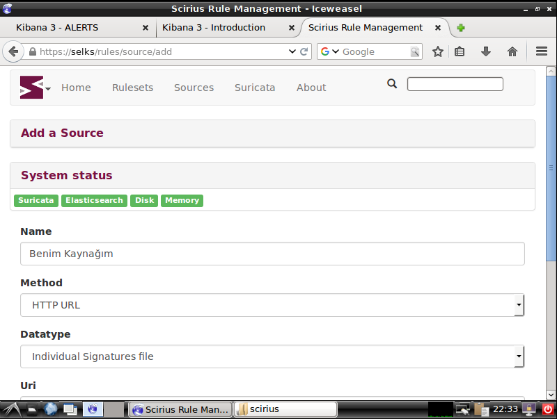{width="4.693069772528434in"
height="3.5373906386701663in"}

Veri tipi “**Signature files in the tar archive”** olan kaynaklar şu
kurallara uymak zorundadır:

-   **tar** arşiv dosyası olmalı ve

-   Tüm dosyalar **rules** dizini altında olmalı

Örneğin ETOpen kural setini Suricata 2.0.1 için eklemek istersek
alanları aşağıdaki gibi doldurabiliriz.

-   **İsim (Name):** ETOpen Ruleset (ismi kendimiz belirliyoruz,
    herhangi bir isim koyulabilir)

-   **URI:**
    <https://rules.emergingthreats.net/open/suricata-2.0.1/emerging.rules.tar.gz>

Veri tipi “**Individual signature files”** olan kaynaklar bir veya
birçok imza içeren tek bir dosya olmalı.

Örneğin, abuse.cl adresindeki blacklist listesini kullanmak istiyorsak
alanları aşağıdaki gibi doldurabiliriz.

-   **İsim (Name):** SSLBL abuse.ch

-   **URI:** <https://sslbl.abuse.ch/blacklist/sslblacklist.rules>

**Kaynakları Güncelleme**

Güncellemek istediğimiz kaynağı web arayüzündeki **Sources** kısmına
girip listeden bulup seçiyoruz. Örneğin SSLBL abuse.ch kaynak setini
güncellemek istiyorsak listeden seçtikten sonra karşımıza gelen
**Action** kısmından Update seçeneğini seçiyoruz. Güncelleme
tamamlandıktan sonra karşımıza gelen “**Changelog**” sayfası ise bize
yeni eklenen kuralların, güncellenmiş olan kuralların ve daha önceki
güncelleme bilgilerinin olduğu tablolar gösteriyor.

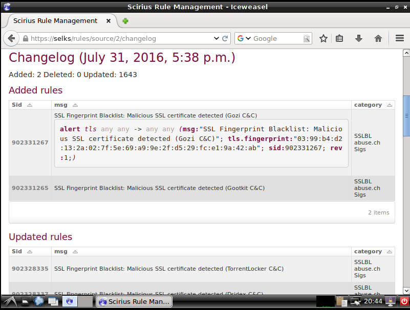{width="4.809916885389327in"
height="3.645080927384077in"}

Kuralın üstündeki msg bölümüne tıkladığımızda ise içeriğini
görebiliyoruz. SID(imza numarasına) tıklarsak imza hakkında daha detaylı
bir bölüm gelecektir, burada kural tanımı, dizin ve bu kuralın son 1
hafta içerisindeki aktivitelerini gösteren grafiği gibi bilgileri
bulabilirsiniz.

**Kural Seti Oluşturma**

Kural Seti oluşturmak için web arayüzündeki **Rulesets** kısmına
girdikten sonra **Actions** kısmında bulunan **Add**’e tıklıyoruz. Kural
setimize isim verdikten sonra kullanacağımız kaynak yada kaynakları
aşağıdaki resimdede görüldüğü gibi Sources kısmından seçip ekledikten
sonra **Add**’e tıkıyoruz.

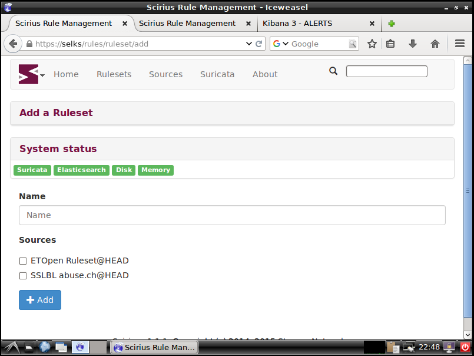{width="4.482871828521435in"
height="3.363636264216973in"}

**Kural Seti Güncelleme**

Kural Seti güncellemek için web arayüzündeki **Rulesets** bölümünden
güncellemek istediğimiz kural setini seçtikten sonra **Actions**
kısmında bulunan **Update**’ye tıklamamız gerekiyor.

**Kural Setini Düzenleme**

Düzenlemek istediğimiz Kural Setini web arayüzündeki Rulesets bölümüne
girip seçtikten sonra Actions kısmında bulunan Edit’e tıklıyoruz.
Sonrasında ise karşımıza aşağıdaki seçenekler çıkıyor.

-   **Edit sources (Kaynakları düzenle)**: Kural listesinde hangi imza
    kaynaklarının kullanılacağını seçmek için kullanılır. Bu seçeneğe
    tıkladıktan sonra karşımıza gelen **Choose sources’** kısmından
    kullanmak istediğimiz kaynakları seçtikten sonra **Update
    Sources**’a tıklıyoruz.

-   **Edit categories (Kategorileri düzenle)**: Kural listesinde hangi
    imza kategorilerinin kullanılacağını seçmek için kullanılır.
    Kullanmak istediğimiz kategorideki imzaları seçtikten sonra **Update
    Sources**’a tıklıyoruz.

-   **Add rule to disabled list (kuralı devredışı bırakılmışlar
    listesine ekle)**: Seçeceğimiz bir kuralı oluşturulacak kural setine
    dahil etmek istemiyorsak bu seçeneği kullanarak devre dışı
    bırakılmışlar listesine ekliyoruz. Bu seçeneğe tıkladıktan sonra
    karşımıza çıkan **Search** arama alanından devre dışı bırakmak
    istediğimiz kuralı SID(imza numarasını) yada imzanın içerisinde
    bulunan diğer elemanlardan birisini kullanarak aratıyoruz. Aramadan
    sonra karşımıza gelen listeden devre dışı bırakmak istediğimiz
    kuralları seçiyoruz ve sonra **Add selected rules to disabled rule
    list**’e tıklıyoruz. Örneğin IIS web serverlarla ilgili kuralları
    devre dışı bırakmak istedik. Arama çubuğuna “IIS” yazıp arattıktan
    sonra listedeki tüm kuralları seçtikten sonra aşağıdaki resimde
    görüldüğü gibi **Add selected rules to disabled rule
    list**’e tıklıyoruz.

    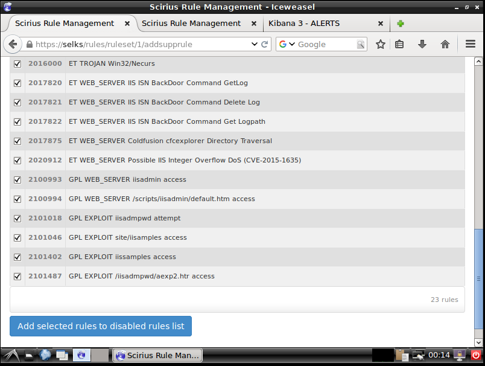{width="4.487603893263342in"
    height="3.3825218722659667in"}

-   **Remove rule from disabled list (kuralı devre dışı bırakılmışlar
    listesinden çıkar):** Daha önceden devre dışı bırakılmışlar
    listesine eklediğimiz bir kural tekrar aktifleştirip, oluşturulacak
    kural setine geri eklemek istiyorsak bu seçeneği kullanıyoruz.
    Aktifleştirmek istediğimiz kuralı devre dışı bırakılmışlar
    listesindenden seçtikten sonra **Remove selected rules from disabled
    rules**’a tıklıyoruz.

**Kibana Dashboards Kullanım**

SELKS’in default olarak 12 den fazla IDS panosu(dashboard)’ı bulunur.
Bunlar ALL, ALERTS, DNS, FILE-Transactions, FLOW, HTTP, HTTP-Extended
Custom, PRIVACY, SMTP, SSH, TLS ve VLAN dır. ALL panosu diğer tüm pano
olaylarını kapsamaktadır.

**Panolara Erişim**

SELKS panolarına LXDE masaüstünden Dashboards’a tıplayıp web arayüzünden
giriş yaptıktan sonra sağ üstte bulunan “load” a tıklayarak
erişebiliriz. Karşımıza çıkan 12 farklı panoya üzerilerine tıklayarak
filtreleyerek erişebiliriz. 12 panonun her birisi Protokollerine göre
ayrı paneller ve listeler içermektedir.

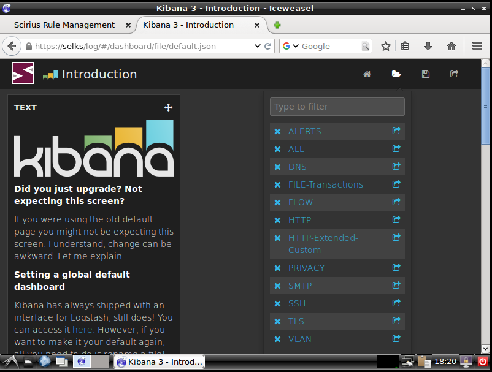{width="4.785123578302712in"
height="3.621545275590551in"}

Örneğin, load kısmından Alarms diyerek Suricata tarafından verilen
Alarmları inceleyelim. Aşağıdaki resimde görüldüğü gibi olayları görmek
istediiğimiz zaman aralığını en üst kısımda bulunan sekmeden
değiştirebiliyoruz. Bu sekmede ayrıca gösterilen verilerin kaç dakikada
bir yenileceğini Auto Refresh ayarını değiştirerek ayarlayabiliriz.

{width="4.710416666666666in"
height="3.5458333333333334in"}

Ayrıca Alarm Panoları sayfasında

-   Alerts sayfasında seçtiğimiz zaman aralığında Suricata’nın
    oluşturduğu alarm grafiği olan EVENTS OVER TIME grafiği

-   Saatlik, günlük ve haftalık olan alarmlardaki artış ve azalışları
    gösteren TRENDS tabloları

-   Saldırıların yapıldığı IP’lerin coğrafi konumlarını gösteren Avrupa,
    Amerika ve Dünya haritaları ve GEOIP LOCALIZATION haritası

-   Alarm kategorilerini ve kategorilerdeki alarm verme sayılarını veren
    tablolar

-   Alarmların imza, imza numaraları, kaynak IP, kaynak port, hedef IP,
    hedef port gibi çok sayıda bilgiyi filtreleyerek görebileceğimiz
    ALERT DETAILS tablosu bulunmaktadır. ALERT DETAILS tablosu örneği
    aşağıdaki resimde görülebilir.

> {width="4.2309317585301836in"
> height="3.173198818897638in"}

Şemayı kaydetmek istersek pano sayfasında bulunan kaydetme işaretine
basıp, advance seçeneğinden export schema dememiz gerekiyor.

Aşağıda ALL panosunuda tüm olayların ve TCP-IP kullanan imza
alarmlarının dairesel grafiği ve en çok alarma neden olan imzaların
listesini görebiliriz.

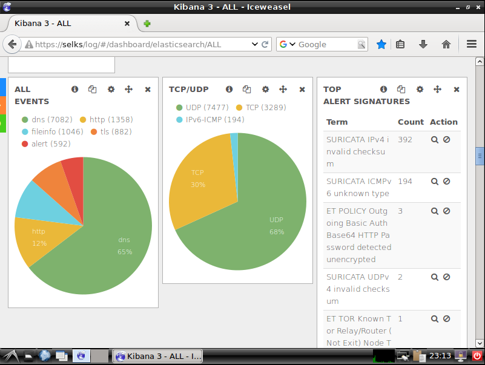{width="4.495867235345582in"
height="3.384290244969379in"}

**Pano ayarları**

Panoları konfigüre etmek içinse, pano sayfasında sağ üst köşede bulunan
configure dashboard işaretine tıklamamız gerekiyor. Burada genel ayarlar
(pano başlığı, pano stili,vb), indeks ayarları(zaman damgası, formatı,
vb), satır ayarları(sıralama), kontrol ayarları(yükleme, kaydetme,
paylaşma, vb) ve pano zaman aralığı ayarları bulunmakta.

**Scirius Kural Seti ile bağlantı**

Web arayüzünde sol üst tarafta buluman **StamusNetworks iconu**na
tıklayıp **Ruleset Management**’a tıklarsak Scirius’un ayayüzündeki Home
sayfası açılacaktır. Bu sayfada Suricatanın kullandığı kural setleri,
kaynaklar ve son 1 hafta içerisindeki alarm grafiğini görebiliriz.
